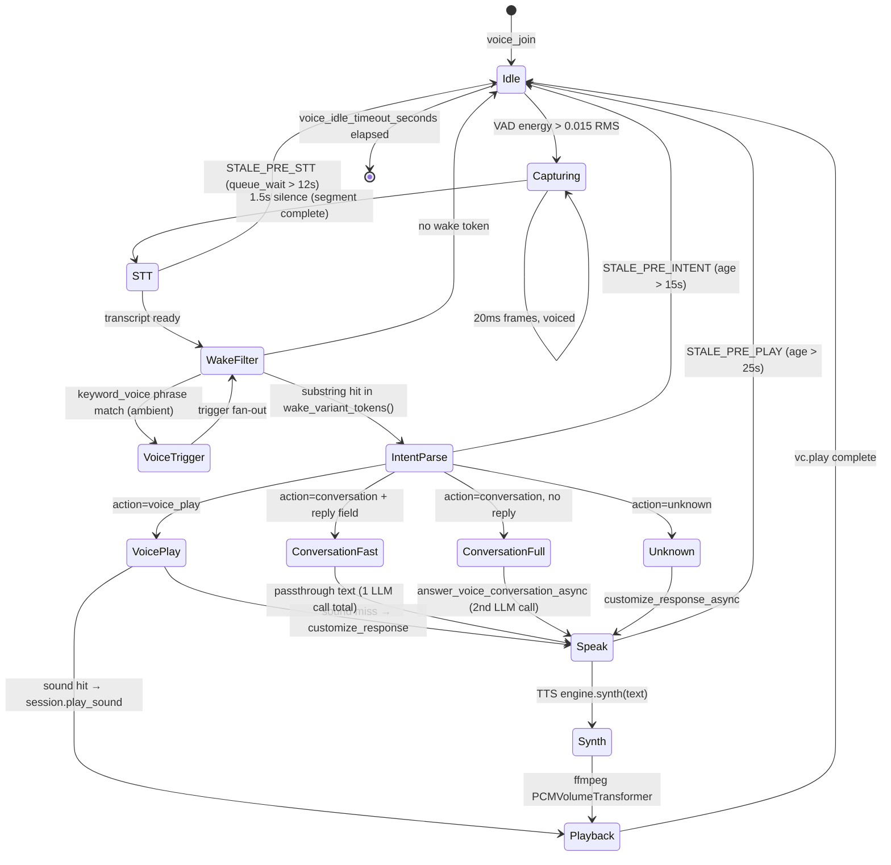

# Voice pipeline

End-to-end shape of the voice path: receive Opus → VAD-segment per user →
faster-whisper STT → wake-word filter → LLM intent → soundboard play
or persona-voiced spoken reply via Kokoro TTS → ffmpeg playback into the
voice channel.

Background plans worth reading before changing this:

- [001 — voice / text decoupling](plans/001-voice-text-decoupling.md) (locked
  decisions on `MessageSink`, voice-history persistence, TTS-vs-text feedback)
- [014 — Discord embed flows](plans/014-discord-embed-flows-impl.md)
  (wake card + voice-trigger card)
- [016 — voice-pipeline benchmarks](plans/016-voice-pipeline-benchmarks-impl.md)
  (STT/TTS/LLM tuning rig under `benchmarks/`)
- [017 — wake variants](plans/017-wake-variants-impl.md) (sqlite-backed
  wake-token dictionary that replaced the hard-coded prefilter)
- [018 — transcript capture](plans/018-transcript-capture-impl.md)
  (rotating JSONL transcript log + DEBUG mirror in main log)

## State machine

High-level lifecycle of a voice turn. Each transition is labeled with
the gate or signal that fires it. Stale-gates short-circuit before
expensive stages — see "Staleness gates" below.



## Module map

| File | Role |
|---|---|
| [halbot/voice.py](../halbot/voice.py) | RTP receive (`HalbotVoiceRecvClient` + DAVE patch), VAD (`_UserAudioState`), faster-whisper wrapper, `VoiceListener`, `VoiceSession`, `MessageSink` family, ffmpeg playback. Owns staleness constants. |
| [halbot/voice_session.py](../halbot/voice_session.py) | `handle_voice_command` callback (NOT the `VoiceSession` dataclass — that lives in `voice.py`). Wake substring filter, `_extract_command`, voice-trigger fan-out, idle-disconnect, sink-spec ↔ sink mapping, snapshot/reconnect, embed cards. |
| [halbot/llm.py](../halbot/llm.py) | `parse_voice_intent` (sound picker), `answer_voice_conversation_async` (full-context spoken reply), `customize_response_async`, `check_wake_word` (legacy LLM classifier — currently unused, see "Wake detection" below). |
| [halbot/tts.py](../halbot/tts.py) | Pluggable TTS engines (`KokoroEngine` is the only one wired up). Lazy load, `unload_engine`, `preload_engine_async`. |
| [halbot/audio.py](../halbot/audio.py) | `detect_audio_format`, `apply_effects_chain`, soundboard validation. |
| [halbot/bot.py](../halbot/bot.py) | `voice_join` / `voice_leave` / `voice_play` action handlers. |

## Frame lifecycle

```
Discord voice WS  →  HalbotVoiceRecvClient (transport-decrypt, then strip
                       DAVE supplemental / DAVE-decrypt per user)
                  →  _HalbotSink.write(user, data)             [router thread]
                  →  resample_48k_stereo_to_16k_mono            [router thread]
                  →  _UserAudioState.feed(user_id, 20ms)       [VAD]
                       └─ on segment complete:
                          run_coroutine_threadsafe(_process_segment, loop)

asyncio loop      →  VoiceListener._process_segment
                  →  STALE_PRE_STT gate
                  →  loop.run_in_executor(None, transcribe)     [worker thread]
                       └─ load_whisper() lazy ← _register_nvidia_dll_dirs
                          model.transcribe(beam_size=1, temperature=0,
                                           initial_prompt=robot-bias)
                  →  on_command(guild, user_id, transcript, captured_at)

handle_voice_command (voice_session.py)
    ↳ _fire_voice_triggers(...)            # ambient — bypasses wake gate
    ↳ _has_wake_candidate(transcript)?     # substring scan vs sqlite dict
        no  → return
    ↳ _extract_command(transcript)
    ↳ STALE_PRE_INTENT gate
    ↳ asyncio.to_thread(parse_voice_intent, command, sounds, saved, history)
        ├─ action="voice_play"     → session.play_sound(...)
        │                             (miss → customize_response_async → _voice_feedback)
        ├─ action="conversation"   → if intent.reply: passthrough → _voice_feedback
        │                             else: answer_voice_conversation_async
        │                                   ↳ _voice_feedback → _speak → TTS → play_sound
        └─ action="unknown"        → customize_response_async → _voice_feedback
    ↳ _post_wake_card(...)

_speak (voice_session.py)
    ↳ STALE_PRE_PLAY gate (uses _wake_captured_at ContextVar)
    ↳ engine.synth(text)            → wav bytes
    ↳ session.play_sound(audio, fmt)
        ↳ tempfile + discord.FFmpegPCMAudio + PCMVolumeTransformer
        ↳ vc.play(source, after=unlink)
```

## Wake detection

**Authoritative wake signal is a substring scan**, not an LLM call.
`_has_wake_candidate` in [voice_session.py](../halbot/voice_session.py)
loops `wake_variant_tokens()` (read from sqlite `wake_variants` table)
and returns true on the first `tok in transcript.lower()` hit.

- The variant table holds three slices keyed by `source` column:
  - `seed` — installer-shipped baseline (`robot`, `ro bot`, `roboto`, …).
  - `llm` — entries written by `/halbot wake-variants generate`.
  - `manual` — entries added by `/halbot wake-variants add` (and
    removable by `…remove`). Use this when whisper coughs up a new
    homophone the seed list missed.
- `voice.py::WAKE_WORD = "robot"` is the canonical English form; only
  `/halbot wake-variants generate` reads it as the LLM seed. Runtime
  matching is purely the sqlite dictionary — no `voice_wake_word`
  config field exists.
- `llm.check_wake_word` and `llm.parse_voice_combined` exist for the
  old LLM-arbitrated wake path. Not on the hot path. Removing them is
  fair game.
- The dictionary is read fresh on every utterance (no cache) so
  slash-command edits land on the next turn without invalidation.

## Staleness gates

Three drop points, all keyed on `time.monotonic()` at VAD finalization
(propagated via the `_wake_captured_at` ContextVar):

| Constant (voice.py) | Default | Drops |
|---|---|---|
| `STALE_PRE_STT_SECONDS` | 12 s | Skip whisper if asyncio queue backed up |
| `STALE_PRE_INTENT_SECONDS` | 15 s | Skip LLM intent if STT finished too late |
| `STALE_PRE_PLAY_SECONDS` | 25 s | Drop TTS playback if synth would land too late |

Rationale: a 2-minute-late "yes I heard you" is worse than silence. The
gates short-circuit before each expensive stage, not after.

## VRAM lifecycle

GPU contention with Ollama (~12 GiB resident) was the source of two
hard-to-diagnose crashes (NVIDIA TDR + msvcp140 access violation):

- **Whisper** (`load_whisper`): lazy, `large-v3-turbo` on CUDA float16
  (~5–6 GiB). Unloaded by `_maybe_unload_whisper` when last session ends —
  forces `gc.collect()` then `torch.cuda.empty_cache()`.
- **Kokoro** (`KokoroEngine._load`): forced to **CPU** even though CUDA is
  available. Sharing GPU with Ollama crashed the driver. Quality + speed
  on CPU are fine for real-time replies.
- `preload_engine_async` warms Kokoro on a background thread at
  voice-join so the first reply doesn't eat the ~10 s cold start.

`_register_nvidia_dll_dirs` walks `site-packages/nvidia/*/bin/`,
registers each via `os.add_dll_directory`, AND prepends to `PATH` —
ctranslate2's lazy cublas load bypasses the search-flag mechanism.

## Sessions, sinks, history

`VoiceSession` (dataclass in `voice.py`) aggregates:

- `listener: VoiceListener` — STT/VAD service (no text-channel reference)
- `message_sink: MessageSink` — feedback target. Default `VoiceChatSink`
  (post into the voice channel's own chat pane). Falls back to
  `LogOnlySink` on perm/feature failure (one WARNING per session, then
  silent — decision 1a in plan 001).
- `history: list[dict]` — rolling per-guild voice turns. Loaded from
  SQLite on join via `voice_history_load`; capped to `VOICE_HISTORY_TURNS`
  (config, default 10).

`voice_listeners: dict[int, VoiceSession]` is keyed by guild id.
Reconnect snapshot stores `(vc_channel_id, sink_spec)`; `sink_spec` is a
discriminated tuple (`("voice_chat",)`, `("text_channel", id)`,
`("log_only",)`).

## Voice triggers

`_fire_voice_triggers` runs **before** the wake gate on every transcript.
That's intentional — keyword_voice triggers are the "ambient reflex"
mechanism (slur → cough sound, etc.). Don't move the call past the
wake-candidate filter.

## Config knobs

In [halbot/config.py](../halbot/config.py) (registry layer:
`HKLM\SOFTWARE\Halbot\Config`):

| Key | Default | Used by |
|---|---|---|
| `voice_idle_timeout_seconds` | `1800` | `_voice_idle_disconnect` (per-guild leave timer) |
| `voice_history_turns` | `10` | rolling per-session voice history fed to LLM |
| `transcript_log_enabled` | `false` | gates `transcripts.jsonl` writes; DEBUG mirror always fires |
| `tts_engine` | `kokoro` | `tts.get_engine` |
| `tts_voice` | `af_heart` | `KokoroEngine` |
| `tts_lang` | `a` | `KokoroEngine` |
| `tts_speed` | `1.0` | `KokoroEngine` |
| `llm_model` | (registry) | all LLM calls (live registry: `gemma4:e2b`) |
| `llm_max_tokens_text` | `512` | text-grade LLM cap; `parse_voice_intent` hard-codes 256 |
| `llm_keepalive_minutes` | `10` | `keep_alive` body field on every ollama call |
| `llm_keepalive_interval_seconds` | `240` | background `/api/generate` ping cadence |

Voice-specific tunables that are **not** registry-backed (constants in
[voice.py](../halbot/voice.py)): `WAKE_WORD = "robot"`,
`ENERGY_THRESHOLD = 0.015`, `STALE_PRE_STT_SECONDS = 12`,
`STALE_PRE_INTENT_SECONDS = 15`, `STALE_PRE_PLAY_SECONDS = 25`.

## Common pitfalls

- **DAVE supplemental tail.** Discord now mandates DAVE E2EE on top of
  transport encryption. `HalbotVoiceRecvClient._patch_dave_decryption`
  monkey-patches `decryptor.decrypt_rtp` to either decrypt with the
  davey session (when `session.ready` and SSRC→user mapped) or strip
  the supplemental tail. Any failure returns the well-known 3-byte Opus
  silence frame `b"\xf8\xff\xfe"` — handing the Opus decoder ciphertext
  kills the PacketRouter thread and the whole receive pipeline stops
  until reconnect.
- **`voice_recv` `_reader` may be `None`** before listen completes —
  `_patch_dave_decryption` no-ops in that window.
- **`discord.ext.voice_recv.reader` floods INFO at 1 Hz** ("unexpected
  rtcp packet"). `VoiceListener.start` raises it to WARNING.
- **Other voice-recv loggers spam DEBUG.** `discord.ext.voice_recv.router`
  emits two "Dispatching voice_client event rtcp_packet" lines per
  second whenever a voice connection is open; `discord.gateway` dumps
  full payload dicts at DEBUG. `logging_setup.reconfigure` clamps these
  (plus `grpc._cython.cygrpc`, `discord.http`, `discord.voice_state`,
  `discord.player`) above DEBUG so `log_level=DEBUG` stays readable for
  transcript / `[voice-cmd]` / `[stt]` lines.
- **AudioSink runs on the router thread, not the asyncio loop.** Hand
  segments back via `asyncio.run_coroutine_threadsafe(... , self._loop)`.
- **`_users` defaultdict grows unbounded** without the
  `on_voice_member_disconnect` listener — it pops state on disconnect.
- **Concurrent transcribe calls thrash GPU.** `_transcribe_lock`
  serializes them.

## Verifying changes locally

- LLM / prompt: hit ollama at `http://localhost:11434/v1/chat/completions`
  with the same body shape `parse_voice_intent` builds. Watch
  `finish_reason`, `usage`, and `choices[0].message.reasoning` (gemma4
  reasons before answering — empty `content` + non-empty `reasoning`
  means truncation).
- STT / VAD: `benchmarks/_out/<ts>/stt-*.jsonl` carry per-utterance
  latency + transcript across the corpus in `benchmarks/corpus/voice/`.
- TTS: `benchmarks/_out/<ts>/tts-*.jsonl` (kokoro and chatterbox runs).
- Live: deploy with `scripts\deploy.ps1 -Daemon`, then grep
  `C:\ProgramData\Halbot\logs\halbot.log` for `[stt]`, `[voice-cmd]`,
  `[tts]`, `[play]` stage lines.
- Real Discord audio: this is the one channel you can't fully self-test.
  Do every other check first, then ask the user to repro in voice.
